# はじめてのDroonga

subtitle
:   　　
    Droongaの簡単な紹介と
    Groongaからの移行手順

author
:   結城洋志

institution
:   株式会社クリアコード

allotted_time
:   30m

theme
:   groonga

# 要旨

「自作のアプリケーションを
GroongaからDroongaへ
今すぐ移行できるのか？」
にお答えします

# 気になる点、疑問点

 * 気になる事があったら：
   * メモして後から質問
   * その場で質問してもOK
 * どこが気になったかを
   教えてください！

# アジェンダ

 * Droongaとは？
   * Droongaの何が嬉しい？
   * Droongaの何が嬉しくない？
 * デモ

# Groongaの困った所

 * 分散が流行ってる
 * Groongaは分散処理に
   対応していない

# Droongaとは

*D*istributed G*roonga*
＝分散Groonga

# サーバ構成の違い

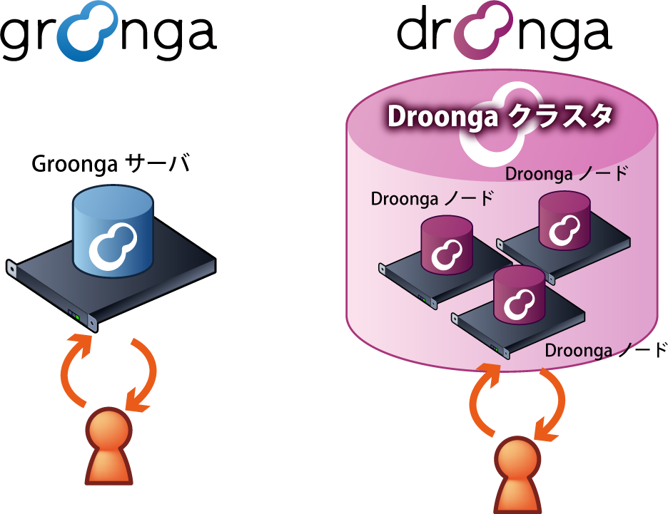{:relative_height='95'}

# Groonga互換

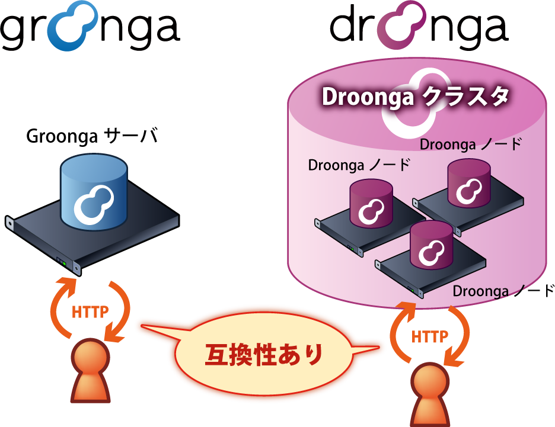{:relative_height='95'}

# Groonga互換

 * 今までと同じ感覚で使える
 * Groongaベースの
   既存のアプリケーションを
   最小の工数で分散対応できる

# データベースを分散

 * *レプリケーション*
   * 現在の開発はここに注力
 * *パーティショニング*
   * 現在は部分的に対応（これから改善）

# レプリケーション？

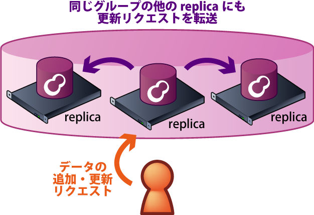{:relative_width="35" align="left" relative_margin_left="-20"}

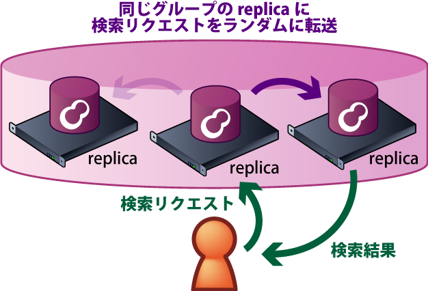{:relative_width="45" align="right"}

# パーティショニング？

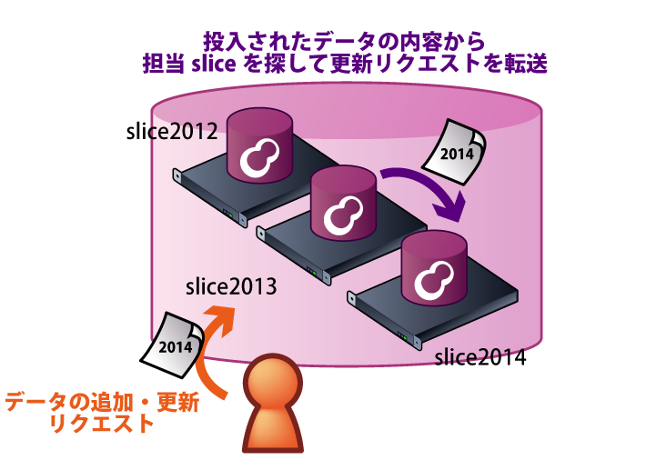{:relative_width="40" align="left" relative_margin_left="-20"}

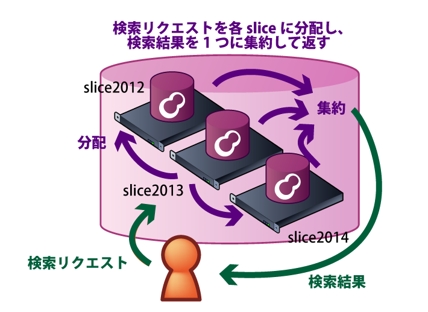{:relative_width="50" align="right"}

# Groonga→Droonga

今現在得られるメリット

 * *レプリケーションできる*
   ようになる
 * ノードを*簡単に追加・削除*できる

# レプリケーション無しだと(1)

{:relative_height='90'}

# レプリケーション無しだと(1)

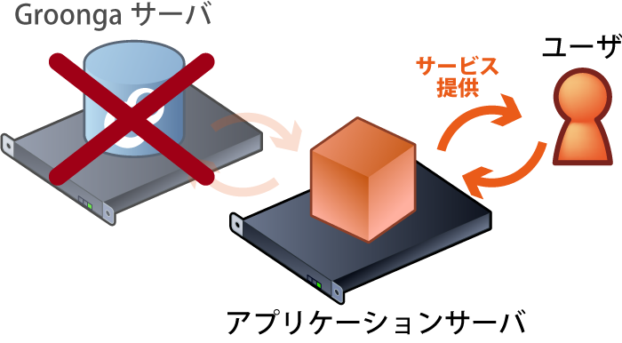{:relative_height='90'}

# レプリケーション無しだと(1)

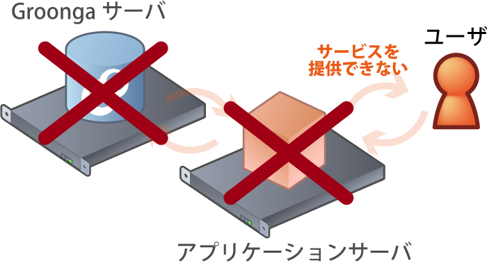{:relative_height='90'}

# レプリケーション無しだと(2)

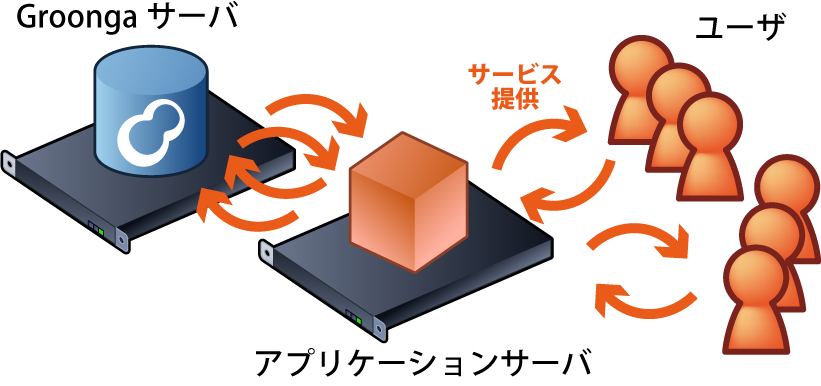{:relative_height='90'}

# レプリケーション無しだと(2)

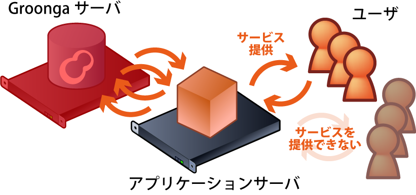{:relative_height='90'}

# レプリケーション有りだと(1)

{:relative_height='90'}

# レプリケーション有りだと(1)

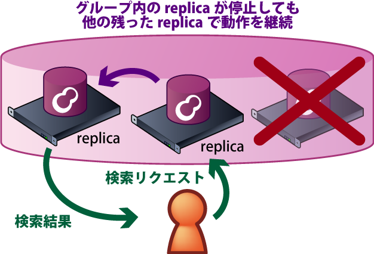{:relative_height='90'}

# レプリケーション有りだと(1)

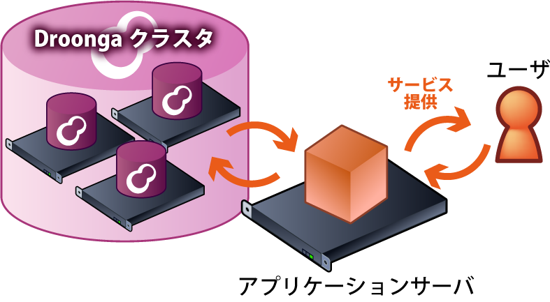{:relative_height='90'}

# レプリケーション有りだと(1)

{:relative_height='90'}

# レプリケーション有りだと(2)

{:relative_height='90'}

# レプリケーション有りだと(2)

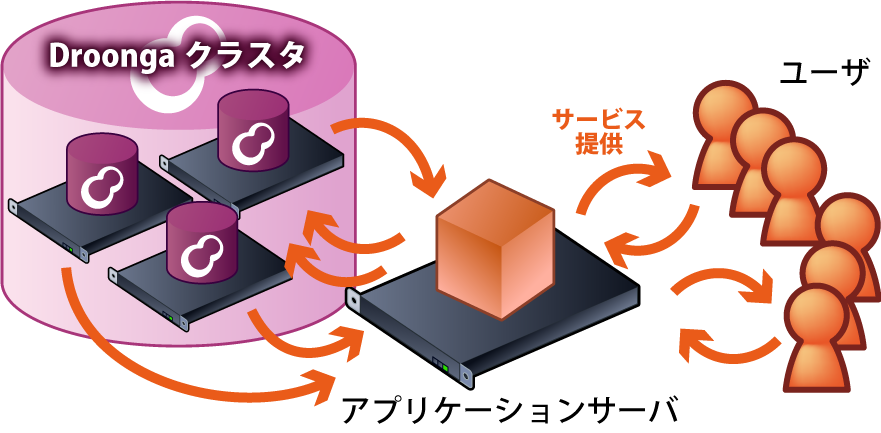{:relative_height='90'}

# クラスタ構成の変更

付属のコマンドラインユーティリティを使用

 * droonga-engine-join
 * droonga-engine-unjoin

# ノードの追加

    % droonga-engine-join --host=cccc --replica-source-host=bbbb

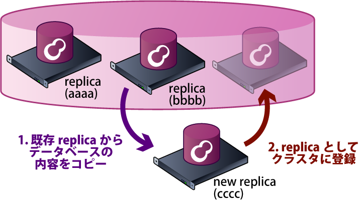{:relative_height='100'}

# ノードの切り離し

    % droonga-engine-unjoin --host=cccc

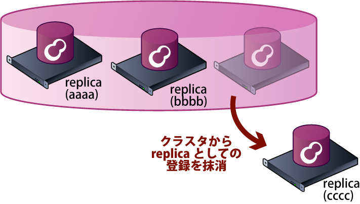{:relative_height='100'}

## パーティショニング

{:relative_height='90'}

## パーティショニング

{:relative_height='90'}

## パーティショニング

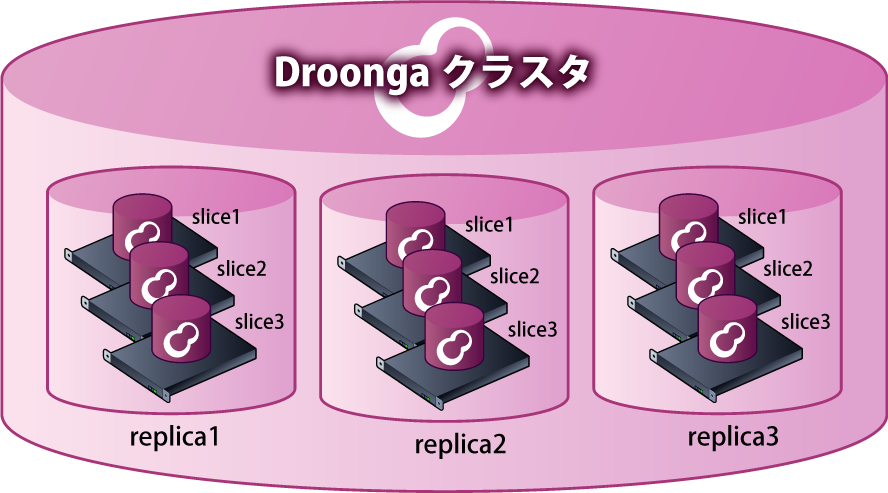{:relative_height='90'}

## パーティショニング

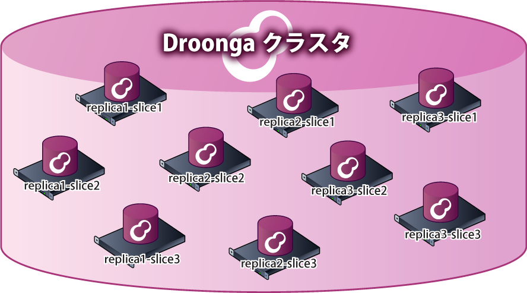{:relative_height='90'}

# デモ

 * Groongaベースの
   アプリケーションを作成
 * Droongaクラスタを構築
 * バックエンドをDroongaに移行

（[Groongaユーザ向けの、はじめてのDroonga](http://www.clear-code.com/blog/2014/7/11.html)
　と同内容です）

# デモ：用意する物

 * サーバ2つ
   * 192.168.100.50
   * 192.168.100.51

## 実行するコマンド

Groongaのインストール

    % sudo apt-get -y install software-properties-common
    % sudo add-apt-repository -y universe
    % sudo add-apt-repository -y ppa:groonga/ppa
    % sudo apt-get update
    % sudo apt-get -y install groonga

データベース作成

    % mkdir -p $HOME/groonga/db/
    % groonga -n $HOME/groonga/db/db quit

テーブル定義

    % groonga $HOME/groonga/db/db table_create --name Topic --flags TABLE_PAT_KEY --key_type ShortText
    % groonga $HOME/groonga/db/db column_create --table Topic --name title --flags COLUMN_SCALAR --type ShortText
    % groonga $HOME/groonga/db/db table_create --name Term --flags TABLE_PAT_KEY --key_type ShortText -- d ef aul t_tokenizer TokenBigram --normalizer NormalizerAuto
    % groonga $HOME/groonga/db/db column_create --table Term --name topic_title --flags "COLUMN_INDEX|WITH_POSITION" --type Topic --source title

GroongaをHTTPサーバとして起動

    % groonga -p 10041 -d --protocol http $HOME/groonga/db/db

Webサーバを起動

    % ruby -run -e httpd -- --port 8080 demo/ &

Droongaのインストール

    (on 192.168.100.50, 192.168.100.51)
    % sudo apt-get update
    % sudo apt-get -y upgrade
    % sudo apt-get install -y libgroonga-dev ruby ruby-dev build-essential nodejs nodejs-legacy npm
    % sudo gem install droonga-engine
    % sudo npm install -g droonga-http-server
    % mkdir ~/droonga
    % droonga-engine-catalog-generate --hosts=192.168.100.50,192.168.100.51 --output=~/droonga/catalog.json

サービス起動

    (on 192.168.100.50)
    % export host=192.168.100.50
    % export DROONGA_BASE_DIR=$HOME/droonga
    % droonga-engine \
        --host=$host \
        --log-file=$DROONGA_BASE_DIR/droonga-engine.log \
        --daemon \
        --pid-file=$DROONGA_BASE_DIR/droonga-engine.pid
    % droonga-http-server \
        --port=10042 \
        --receive-host-name=$host \
        --droonga-engine-host-name=$host \
        --environment=production \
        --daemon \
        --pid-file=$DROONGA_BASE_DIR/droonga-http-server.pid

    (on 192.168.100.51)
    % export host=192.168.100.51
    % export DROONGA_BASE_DIR=$HOME/droonga
    % droonga-engine \
        --host=$host \
        --log-file=$DROONGA_BASE_DIR/droonga-engine.log \
        --daemon \
        --pid-file=$DROONGA_BASE_DIR/droonga-engine.pid
    % droonga-http-server \
        --port=10042 \
        --receive-host-name=$host \
        --droonga-engine-host-name=$host \
        --environment=production \
        --daemon \
        --pid-file=$DROONGA_BASE_DIR/droonga-http-server.pid

動作確認

    % curl "http://192.168.100.50:10042/droonga/system/status"

データの引き継ぎに必要なツール

    % sudo gem install grn2drn droonga-client

データの引き継ぎ

    % grndump ~/groonga/db/db | grn2drn | \
        droonga-send --server=192.168.100.50

接続先の切り替え

    % vi demo/index.html
    -  var base = 'http://' + location.hostname + ':10041';
    +  var base = 'http://' + location.hostname + ':10042';

# Groonga→Droonga

今現在あるデメリット

 * *レイテンシーが低下*する
   * 処理のオーバーヘッドがある
 * *Groonga非互換*の部分が
   まだある

# Groongaとの性能比較

 * 検索対象：
   Wikipedia日本語版のページ30万件
   （データベースサイズ 約1.1GiB）
 * 検索クエリ：
   ページのタイトル200件
   （キャッシュヒット率50％）

[ベンチマーク取得手順](https://github.com/droonga/presentation-droonga-meetup-1-introduction/tree/master/benchmark)

# Groongaとの性能比較

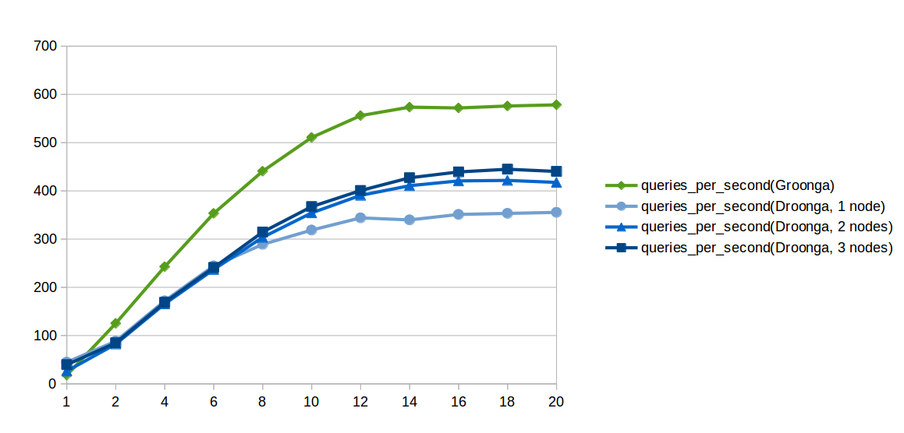{:relative_height='90'}

# Groongaとの性能比較

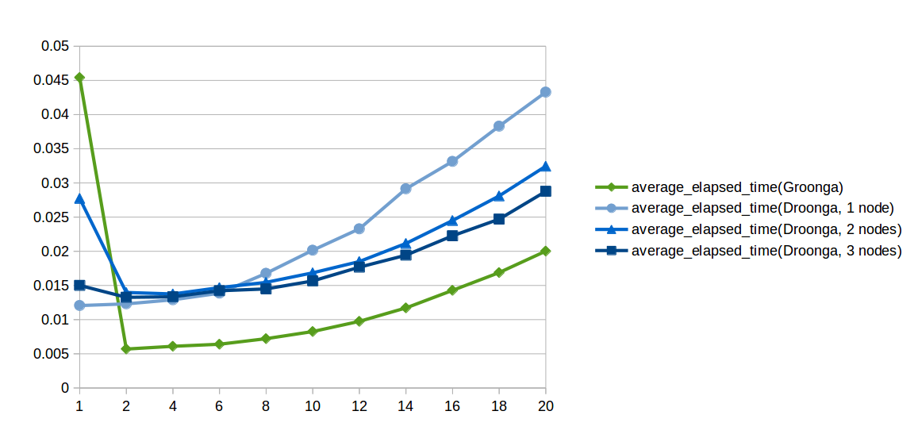{:relative_height='90'}

# Groongaとの性能比較

 * Groonga
   * サーバ1台の処理能力では有利
   * 負荷が増えた時に
     スループットが頭打ちになる
 * Droonga
   * サーバ1台の処理能力では不利
   * 負荷が増えてもノードを増やして
     スループットの上限を増やせる

# 今分かっている遅くなる理由

 * ドリルダウンがあると遅くなる
 * レスポンスのサイズが大きくなると遅くなる
 * クラスタ構成に合わせた
   処理の最適化が不十分

## オーバーヘッド

 * オーバーヘッドがある（レイテンシーが落ちる）
 * Groongaで単一サーバでさばききれる程度のリクエストに対しては、性能面でのメリットはない。
 * 耐障害性の高さ、アクセスの増加への対応のしやすさとのトレードオフ。

# 現時点での互換性（概要）

 * スキーマ変更系
 * `load`, `delete`
 * `select`

それ以外は未対応（今後の課題）

# 現時点での互換性（詳細）

table操作系

 * `table_create`
 * `table_remove`
 * `table_list`

# 現時点での互換性（詳細）

column操作系

 * `column_create`
 * `column_remove`
 * `column_rename`
 * `column_list`

# 現時点での互換性（詳細）

データ更新系

 * `load`
   * ただし、以下は未対応
     `--ifexists`, `--input_type`
 * `delete`

# 現時点での互換性（詳細）

検索系

 * `select`
   * ただし、以下は未対応
     `--scorer`, `--cache`,
     `--match_escalation_threshold`,
     `--query_expansion`,
     `--query_flags`, `--query_expander`,
     `--adjuster`

## 未対応の機能

 * GQTPは喋れない
 * ダッシュボードがまだ無い（Groongaの管理画面はちょっと動く）
 * サジェストもまだ対応していない
 * 監視機能もまだできていない

# とはいえ

{:relative_height="90"}

# 改善にご協力を！

*様々な条件でのベンチマーク結果*

 * できればGroongaでの
   ベンチマーク結果も添えて
 * 開発チームで認識できていない
   ボトルネックを明らかにしたい
 * [ベンチマーク取得手順公開中](https://github.com/droonga/presentation-droonga-meetup-1-introduction/tree/master/benchmark)

# 改善にご協力を！

実際のWebアプリケーションからの
*使い勝手レポート*

 * 互換性向上の作業の
   優先順位付けの参考にしたい

# 改善にご協力を！

フィードバックは
[droonga-engineのissue tracker](https://github.com/droonga/droonga-engine/issues)
もしくは
groonga-dev ML
までお寄せ下さい

## 参考：Droonga以外の分散Groonga

 * MySQL/MariaDB + Mroonga + Spider
 * 自前で頑張る
   （[Yappoさんによる事例](http://blog.yappo.jp/yappo/archives/000843.html)）

